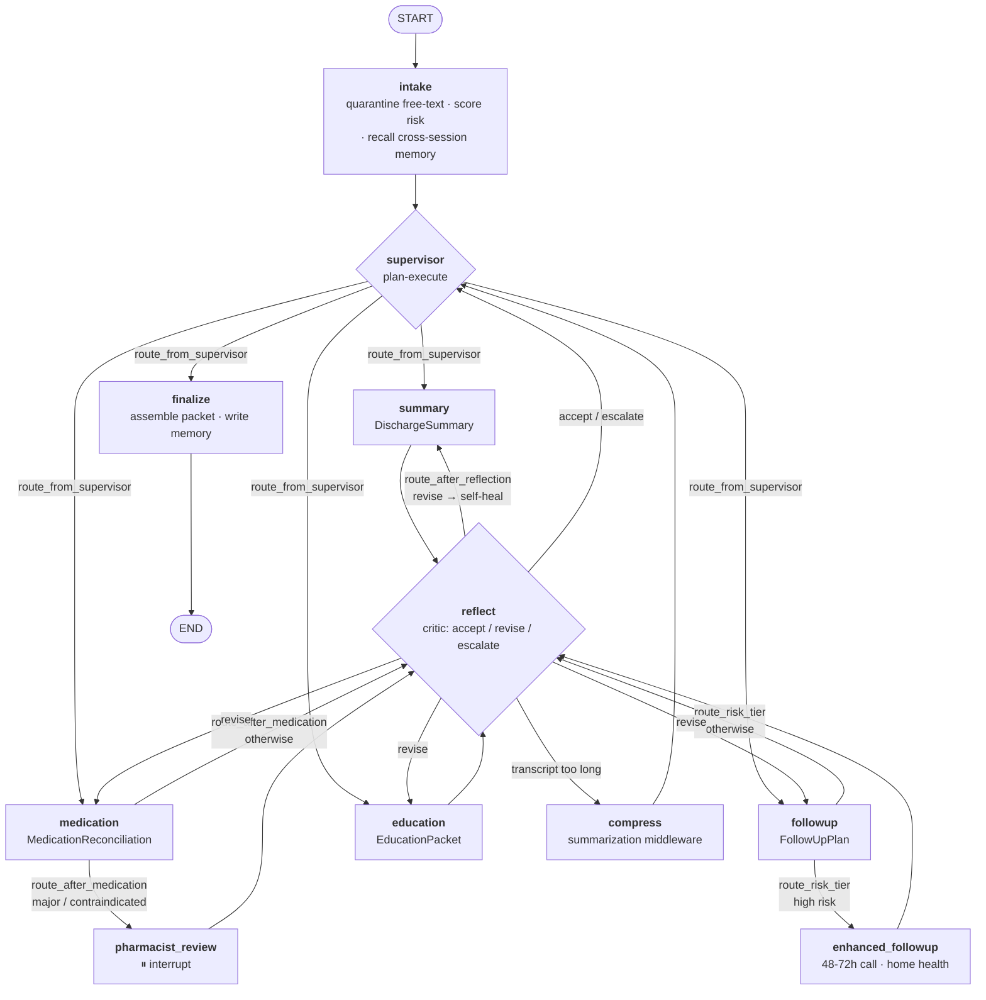

# Architecture

How the discharge copilot is built: the state object every node shares, the graph topology, the
agent patterns, and the contracts at each handoff.

**Covers:** AC-01 (typed state) · AC-02 (supervisor + workers) · AC-03 (conditional routing) ·
AC-04 (structured output) · AC-05 (checkpointing) · §7.3 (agent patterns)

---

## 1. Graph topology



Ten nodes, four conditional routers. The routers are the load-bearing part and are covered in §3.

---

## 2. Typed state (AC-01)

`src/discharge_copilot/state.py` defines `DischargeState`, the single object every node reads
from and writes to.

**Why a `TypedDict` rather than a Pydantic model at the top level.** LangGraph merges the
*partial* dicts a node returns. A Pydantic model at the state root would force every node to
reconstruct and validate the entire object on every return, which is both slow and error-prone.
The values *inside* the state are Pydantic models, so payloads are still strictly validated
(AC-04) — the TypedDict is a container, not an escape from typing.

### Three kinds of field, and why the distinction matters

| Kind | Declaration | Behaviour |
| --- | --- | --- |
| **Replace** | `case_id: str` | A node returning the key overwrites it. |
| **Accumulate** | `Annotated[list[Reflection], operator.add]` | Node returns are appended. |
| **Merge** | `Annotated[dict[str, int], merge_dicts]` | Shallow-merged, right wins. |

The accumulators are not decoration. Without `operator.add` on `reflections`, a self-healing
retry emitting a second reflection would *erase the first* — destroying exactly the evidence
AC-12 depends on. `retry_counts` uses `merge_dicts` so two workers incrementing their own
counters cannot clobber each other.

### Field groups

```python
class DischargeState(TypedDict, total=False):
    # identity
    case_id: str; session_id: str; trace_id: str

    # inputs — free-text arrives already quarantined (NFR-03)
    patient: PatientRecord
    quarantined_notes: list[QuarantinedNote]

    # T1 working memory
    messages: Annotated[list[AnyMessage], add_messages]
    compressed_history: str
    compression_events: Annotated[list[dict], operator.add]

    # supervisor control
    plan: list[str]; next_agent: str
    completed: Annotated[list[str], operator.add]
    supervisor_steps: int

    # worker outputs — each a validated Pydantic model (AC-04)
    risk: RiskAssessment
    summary: DischargeSummary
    medications: MedicationReconciliation
    followup: FollowUpPlan
    education: EducationPacket

    # reflection / self-healing (AC-12)
    reflections: Annotated[list[Reflection], operator.add]
    retry_counts: Annotated[dict[str, int], merge_dicts]
    tool_failures: Annotated[list[ToolFailure], operator.add]
    pending_revision: dict

    # memory + evidence
    memory_hits: list[MemoryHit]
    memory_writes: Annotated[list[dict], operator.add]
    escalations: Annotated[list[str], operator.add]
    routing_decisions: Annotated[list[dict], operator.add]

    # terminal
    packet: dict; status: str; fault_inject: str
```

---

## 3. Conditional routing (AC-03)

Four routers in `graph.py`, **each a pure function of state**.

| Router | From | Branches on | Targets |
| --- | --- | --- | --- |
| `route_from_supervisor` | `supervisor` | the supervisor's choice | 4 workers · `finalize` |
| `route_after_medication` | `medication` | interaction severity | `pharmacist_review` · `reflect` |
| `route_risk_tier` | `followup` | readmission risk tier | `enhanced_followup` · `reflect` |
| `route_after_reflection` | `reflect` | critic verdict, transcript size | worker · `compress` · `supervisor` |

### Why purity is a design requirement, not a stylistic preference

Every branch is unit-tested by constructing a state dict — no LLM, no network
(`tests/test_ac03_conditional_routing.py`). Routing that can only be reached through a full live
run is routing whose edges are never actually tested, and edge cases are exactly where routing
goes wrong.

### Why routing reads derived properties, not model output

`route_after_medication` calls `MedicationReconciliation.needs_pharmacist()`, which is computed
from the interaction severities — **not** the model's own `pharmacist_review_required` boolean.
Models set that flag inconsistently. If routing trusted it, a forgotten boolean would silently
suppress a pharmacist escalation on a contraindicated interaction. The model describes; the code
decides.

The same principle applies at `_post_followup`, which forces `enhanced_pathway` to agree with the
assessed risk tier.

---

## 4. Agent patterns (§7.3)

Three named patterns, each where it fits, rather than one bolted on for the rubric.

### Plan-execute — the supervisor

The supervisor emits an ordered plan over the four workstreams and dispatches one worker per
turn, **re-planning each turn** against what has actually completed and what the critic has said.
Re-planning rather than executing a frozen list is what lets a rejected worker change the
ordering mid-run.

Dependency constraints are enforced **in code as well as in the prompt** (`_legal_next`):
reconciliation precedes follow-up; both precede education. A model choice that violates them is
overridden and traced as `supervisor_override`. Prompts express intent; code enforces invariants.

### ReAct — inside each worker

Each worker runs a bounded tool loop before committing to an artifact (`_react_phase`): decide
what to look up, look it up, observe, repeat, then produce the validated object.

The two phases are separate calls because Gemini will not reliably do tool-calling and
constrained structured output in one request — and because the separation makes the reasoning
legible in the trace: you can see what the agent chose to check, then what it concluded.

Tool access is **scoped per worker** (`WORKER_TOOLS`). The education worker cannot book
appointments. This is part of the isolation boundary, not a shared pool.

### Reflection — the critic

Every artifact passes a critic before entering state. The critic is a separate call with a
separate prompt and no memory of *producing* the artifact — a generator grading its own work
tends to accept it.

**Deterministic pre-checks run first.** Some defects are decidable in code: a reconciliation that
dropped a pre-admission medication, a discharge medication overlapping a documented allergy, an
education packet with no red flags. Checking those in `structural_issues()` makes the critic's
job narrower, its verdict more reliable, and those guarantees hold even when the model is
unavailable. A critic that accepts an artifact with confirmed structural defects is overridden.

---

## 5. Structured output (AC-04)

Every worker binds exactly one Pydantic model via `.with_structured_output(...)`. One schema per
worker is the central argument for the multi-agent topology — see
[`single-vs-multi-agent.md`](single-vs-multi-agent.md).

| Node | Contract |
| --- | --- |
| `supervisor` | `SupervisorPlan` — closed set of dispatch targets |
| `summary` | `DischargeSummary` — `hospital_course` has a minimum length |
| `medication` | `MedicationReconciliation` — closed action set, graded severities |
| `followup` | `FollowUpPlan` — appointment windows bounded to 0–180 days |
| `education` | `EducationPacket` — **at least one red-flag symptom, enforced by a validator** |
| `reflect` | `Reflection` — confidence bounded to [0, 1] |
| `compress` | `CompressedHistory` — findings and open issues in dedicated fields |

The schemas reject bad data rather than merely describing good data. `EducationPacket` refuses to
validate with an empty `red_flag_symptoms` list, because a discharge packet without red-flag
guidance is a safety gap and not a stylistic choice.

**A `ValidationError` is not a crash.** It is caught in `llm.invoke_structured`, appended to the
conversation as feedback, and retried; on exhaustion it becomes an `LLMFailure` that the worker
converts into a recorded failure for the critic to act on.

---

## 6. Checkpointing (AC-05)

`SqliteSaver` over `.state/checkpoints.sqlite`, keyed by `thread_id = case_id`.

**One detail that matters.** The checkpointer is built from a raw `sqlite3` connection, not from
`SqliteSaver.from_conn_string()`. The latter is a context manager that closes the database on
exit — which would work in a single script and fail exactly where AC-05 requires success: across
a process boundary. `check_same_thread=False` because LangGraph may run nodes on a worker thread.

The graph compiles with `interrupt_before=["pharmacist_review"]`, so a serious interaction halts
the run for human sign-off. `run --pause-after` and `resume --case-id` are deliberately separate
CLI commands, run as separate processes.

---

## 7. Failure handling (NFR-07)

Failure is an operating condition, not an exception. Every layer degrades rather than raising:

| Failure | Behaviour |
| --- | --- |
| Transient model error (429/503/timeout) | Retried with exponential backoff, each attempt traced |
| Deterministic model error (404, bad request) | Fails fast — retrying a 404 wastes the budget a 503 needs |
| Schema validation failure | Error fed back to the model, retried, then handed to the critic |
| Worker produces nothing | Recorded as a `tool_failure`; other workstreams keep their results |
| MCP tool timeout or error | Returned as a readable observation the model can reason about |
| MCP server will not start | Workers run with the remaining tools; `toolbox_degraded` traced |
| Critic unavailable | Falls back to the deterministic structural verdict |
| Supervisor step budget exhausted | Finalizes with a partial packet and an escalation |
| Self-heal budget exhausted | `REVISE` becomes `ESCALATE` — ships a flagged draft, does not loop |

The governing rule: **a partial packet with honest escalations beats no packet.** A clinician can
act on a flagged draft; they cannot act on a stack trace.

---

## 8. Tool integration — retrieval and tools live *inside* the orchestration

Worth stating explicitly, because it is the kind of property that is true in the code and
invisible in a summary: **no tool in this system runs outside the graph.** There is no standalone
retrieval chain, no pre-fetch step, and no code path that reaches a tool without passing through a
LangGraph node.

### Chain of custody

```
cli.py                     build_toolbox()  -> MCP tools + agentic-RAG tool
  └─▶ build_graph(tools=…)                     tools handed to the graph, not to a chain
       └─▶ graph.add_node("medication", make_medication_node(tracer, tools))
            │                                  a LangGraph node owns the tools
            └─▶ _react_phase(...)              the node's own ReAct loop
                 └─▶ tool.invoke(args)         ← every tool call originates here
```

`search_clinical_guidance` (AC-11) and the four MCP tools (AC-10) enter through the same door and
are invoked at the same place. Retrieval is therefore *inside the reasoning loop* by construction —
it is not a pipeline stage that happens to sit next to the agent.

### Tool access is scoped per worker

Tools are not a shared pool. `WORKER_TOOLS` in `nodes/workers.py` says which worker may reach
which tool, and `_react_phase` filters to that subset before binding:

| Worker | patient_lookup | interaction_check | schedule_followup | transport | RAG |
| --- | :-: | :-: | :-: | :-: | :-: |
| summary | ✓ | | | | ✓ |
| medication | ✓ | ✓ | | | ✓ |
| followup | | | ✓ | ✓ | ✓ |
| education | | | | | ✓ |

The education worker cannot book an appointment. That is part of the same isolation boundary as
the context slicing in `context/assembly.py` — capability isolation and context isolation are two
halves of one idea.

### On LCEL and why the graph replaces pipe composition

This project uses the LangChain **Runnable interface** throughout — `with_structured_output()`,
`bind_tools()` and `.invoke()` are all LCEL runtime — but deliberately does not use LCEL *pipe
composition* (`prompt | model | parser`).

LCEL chains are the right tool when there is no orchestrator: they compose a linear sequence of
steps into one callable. Here LangGraph **is** the orchestrator, and it composes at a higher level
— typed state, conditional edges, cycles, checkpointing and interrupts, none of which a pipe
expresses. Wrapping node bodies in pipe chains would place a second composition layer inside the
first, and would obscure the very things the architecture is built around: a self-healing cycle
back to the same worker, and a durable pause at `pharmacist_review`.

The one place a linear chain would fit — a single-shot prompt/model/parse — is `llm.invoke_structured`,
and that function deliberately wraps its runnable in retry, backoff, token accounting and
validation-error feedback. Those are exactly the concerns a bare pipe drops.

---

## 9. Module map

```
src/discharge_copilot/
├── state.py        DischargeState + reducers                        AC-01
├── schemas.py      Pydantic handoff contracts                       AC-04
├── graph.py        topology · 4 routers · checkpointer              AC-02/03/05
├── graph_single.py single-agent variant, for the NFR-06 comparison
├── llm.py          Gemini access · retries · timeouts               NFR-07
├── tracing.py      JSONL traces · PII redaction                     NFR-04/05
├── cli.py          run / resume / show / memory                     NFR-02
├── config.py       env-driven configuration                         NFR-01
├── nodes/
│   ├── intake.py      quarantine · risk scoring · memory recall
│   ├── supervisor.py  plan-execute orchestration                    AC-02
│   ├── workers.py     four specialists, ReAct + structured output   AC-02/04
│   ├── reflection.py  critic + deterministic pre-checks             AC-12
│   ├── compress.py    summarization middleware                      NFR-08
│   └── terminal.py    pharmacist review · enhanced path · finalize
├── memory/         working · episodic · semantic · policy           AC-06/07/08
├── context/        quarantine · assembly                            NFR-03 · §7.4
└── tools/          mcp_client · rag                                 AC-10/11
```
